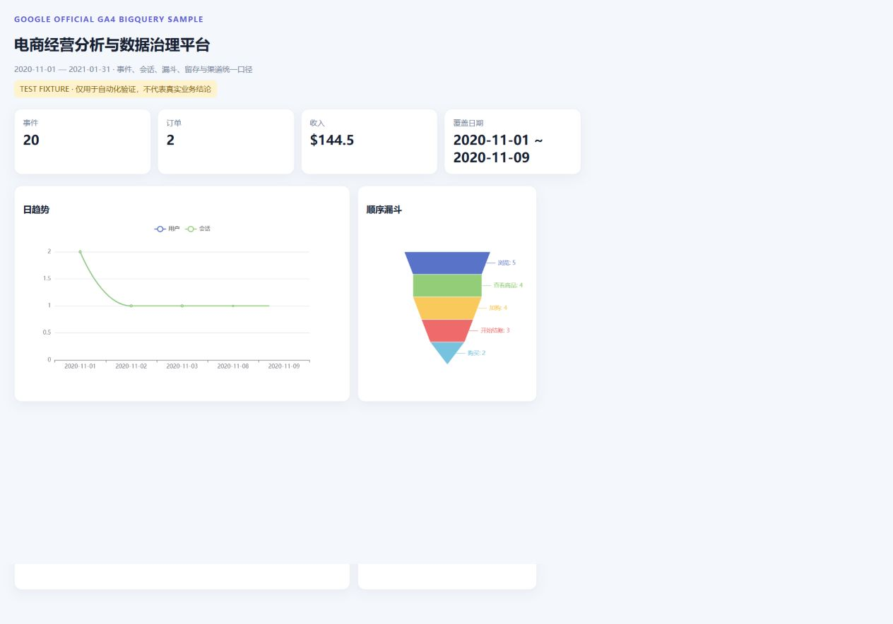

# 基于 GA4 真实数据的电商经营分析与数据治理平台

> GA4 Ecommerce Analytics & Data Platform — Google 官方 BigQuery 电商事件样例的嵌套解析、数仓分层、漏斗留存、质量治理与 BI 交付。



> 上图页面明确显示 TEST FIXTURE，仅证明 API 与图表链路可运行；完成官方导出后将替换为真实数据截图。

## 当前可复现状态

工程代码、BigQuery SQL、本地四层数仓、12 条质量规则、API、看板和 8 个自动化测试均已完成。官方数据源固定为 `bigquery-public-data.ga4_obfuscated_sample_ecommerce.events_*`，日期为 **2020-11-01 至 2021-01-31**。

当前仓库没有提交或伪造正式业务结果：正式提取需要一个已登录、启用 BigQuery 的 Google Cloud 项目。`data/fixtures/events_fixture.csv` 只有 20 行，页面会显示醒目的 **TEST FIXTURE** 标识，任何 `fixture_*` artifact 都不能写入简历。完成云端登录后，一条命令即可生成正式 `pipeline_summary.json` 与真实截图。

## 业务问题

电商经营分析需要从原始事件回答用户与会话规模、浏览→商品→加购→结账→购买的有序转化、收入和订单趋势、新老用户、留存队列、渠道质量、商品表现、用户价值分层与异常日期，同时把口径、质量规则和血缘沉淀为可复用能力。

## 数据来源

- [Google 官方 GA4 BigQuery Sample Ecommerce 说明](https://developers.google.com/analytics/bigquery/web-ecommerce-demo-dataset)
- 表：`bigquery-public-data.ga4_obfuscated_sample_ecommerce.events_*`
- 日期：2020-11-01—2021-01-31，共 92 个自然日
- 限制：官方说明这是经过混淆、模拟真实结构的样例，含占位值且内部一致性有限

## 指标口径

- 用户：`count(distinct user_pseudo_id)`；没有把空 user_id 当真实会员 ID。
- 会话：`user_pseudo_id + ga_session_id`。
- 新用户：发生 `first_visit` 的匿名用户。
- 订单：purchase 事件中非空 `transaction_id` 去重。
- 收入：`ecommerce.purchase_revenue` 求和。
- 漏斗：同一用户 `page_view → view_item → add_to_cart → begin_checkout → purchase` 首次时间单调递增。
- 留存：用户首次活跃周为 cohort，后续活跃周与 cohort 的周差为周期。

完整配置在 [`configs/metrics.yaml`](configs/metrics.yaml)。

## 数据加工与数仓

BigQuery 提取 SQL 使用相关子查询解析 `event_params`，单独 `UNNEST(items)` 避免事件×商品笛卡尔积；DuckDB 建立 ODS 原始导出、DWD 去重事件、DWS 会话主题、ADS 日 KPI/有序漏斗/留存/渠道/RFM/异常。架构和血缘见 [`docs/ARCHITECTURE.md`](docs/ARCHITECTURE.md)。

## 质量保障

12 条规则覆盖时间范围、用户与事件标识、重复事件、收入非负、购买与收入一致性、日汇总对账、漏斗单调性、留存 0 周完整性和购买订单 ID。CI 用明确标记的小 fixture 完整运行所有层；正式导出会产生独立的非 fixture 报告。

## 产品交付

FastAPI 提供 summary/trend/funnel/retention/channels/segments/anomalies 接口，ECharts 页面按 API 动态渲染。标准 Parquet 契约包含事件、日 KPI、漏斗、渠道和用户价值表，可直接接入通用平台。

## 复现方法

```bash
python -m venv .venv
# Windows: .venv\Scripts\activate
# macOS/Linux: source .venv/bin/activate
pip install -r requirements.txt
pip install -e .

# 需要登录 Google Cloud，并设置一个启用 BigQuery 的项目
export GOOGLE_CLOUD_PROJECT=your-project
python scripts/extract_bigquery.py
python scripts/build.py
python -m pytest
uvicorn ga4_platform.api:app --port 8000
```

BigQuery 查询设置 20 GB `maximum_bytes_billed` 安全上限并启用缓存；原始 Parquet 不提交 GitHub。

## 测试验收

- pytest：8 passed / 0 failed（本地实际执行）
- fixture 数据质量：12 passed / 0 failed
- BigQuery SQL：校验官方表、UNNEST、日期边界和非法范围
- 正式数据处理量与结果：等待 Google Cloud 登录后由脚本实际生成，当前不编造

## 面试与简历

- [`docs/INTERVIEW_GUIDE.md`](docs/INTERVIEW_GUIDE.md)
- [`docs/RESUME_BULLETS.md`](docs/RESUME_BULLETS.md)
- [`docs/LIMITATIONS.md`](docs/LIMITATIONS.md)
