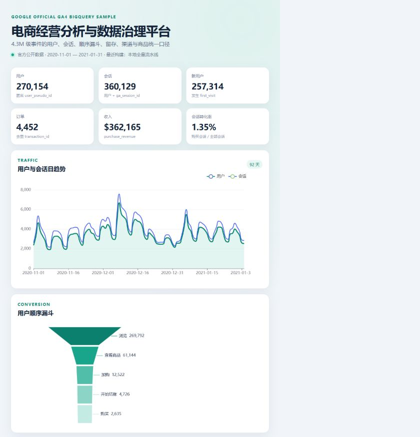

# 基于 GA4 真实数据的电商经营分析与数据治理平台

[](https://github.com/1565819443a-cmyk/ga4-ecommerce-data-platform/actions/workflows/ci.yml)

> GA4 Ecommerce Analytics & Data Platform — 从 Google 官方 BigQuery 电商事件样例出发，完成嵌套解析、数仓分层、指标治理、质量校验、经营分析、API、BI 看板与标准数据契约。



上图来自本仓库实际运行的 **92 天官方 GA4 BigQuery 全量导出**，不是 fixture，也不是手填图片。可审计结果见 [`artifacts/extraction_manifest.json`](artifacts/extraction_manifest.json)、[`artifacts/pipeline_summary.json`](artifacts/pipeline_summary.json) 和 [`artifacts/quality_report.json`](artifacts/quality_report.json)。

## 业务问题

电商埋点数据不能只停留在一次性 SQL。本项目把原始事件转化为可复用数据资产，回答用户与会话规模、浏览到购买的有序转化、收入和订单趋势、新老用户、周留存、渠道质量、商品表现、用户价值分层与异常日期，同时沉淀统一口径、质量规则、血缘、API 和对外 Parquet 契约。

## 数据来源

- 官方说明：[Google Analytics Sample Ecommerce BigQuery Dataset](https://developers.google.com/analytics/bigquery/web-ecommerce-demo-dataset)
- 官方表：`bigquery-public-data.ga4_obfuscated_sample_ecommerce.events_*`
- 处理范围：**2020-11-01—2021-01-31，共 92 个自然日**
- 实际提取：**4,295,584 条事件、3,982,732 条商品明细**
- 查询预检：事件 1,865,461,823 bytes，商品 557,222,912 bytes；每条查询设置 20 GB `maximum_bytes_billed`
- 原始 Parquet 不提交 GitHub；仓库只提交代码、截图与脱敏后的作业/统计清单

这是 Google 提供的公开、经过混淆的演示数据，结构接近真实 GA4 导出，但不代表任何真实商户的当前经营状况。

## 指标口径

- 用户：`count(distinct user_pseudo_id)`；不把空 `user_id` 当会员 ID。
- 会话：`user_pseudo_id + ga_session_id`，避免仅用 `ga_session_id` 造成跨用户碰撞。
- 新用户：发生 `first_visit` 的匿名用户。
- 订单：purchase 事件中的非空 `transaction_id` 去重。
- 收入：`ecommerce.purchase_revenue` 求和。
- 会话转化率：发生 purchase 的去重会话 / 全部去重会话。
- 顺序漏斗：同一用户 `page_view → view_item → add_to_cart → begin_checkout → purchase` 的首次时间必须单调递增。
- 留存：用户首次活跃周为 cohort，后续活跃周与 cohort 周的差为周期。
- 渠道：使用用户首次获取 `traffic_source`；不包装为会话级 last-click 归因。

完整定义见 [`configs/metrics.yaml`](configs/metrics.yaml) 与 [`docs/METRIC_DICTIONARY.md`](docs/METRIC_DICTIONARY.md)。

## 数据加工与数仓模型

BigQuery 使用相关子查询解析 `event_params`，并将 `UNNEST(items)` 放在独立 SQL，避免事件参数与商品数组同时展开造成笛卡尔积。导出脚本按 Arrow batch 流式写入 ZSTD Parquet，在低内存环境也能处理 4.3M 事件。

DuckDB 建立四层模型：

- ODS：官方事件与商品 Parquet 原样接入；
- DWD：字段类型清洗、用户/会话识别、收入修正与事件幂等去重；
- DWS：会话主题汇总；
- ADS：日 KPI、有序漏斗、周留存、渠道、商品、RFM 用户价值与异常日期。

架构和血缘见 [`docs/ARCHITECTURE.md`](docs/ARCHITECTURE.md)，字段定义见 [`docs/DATA_DICTIONARY.md`](docs/DATA_DICTIONARY.md)。增量生产方案按 `_TABLE_SUFFIX` 读取新增或回补日期，DWD 幂等覆盖受影响分区，并重算关联留存 cohort。

## 质量保障

正式全量数据执行 **19 条规则：17 passed、2 warnings、0 failed**。关键规则覆盖时间边界、用户/事件非空、事件去重、收入非负、购买与收入一致、日事件/收入对账、会话主题行数、用户分层行数、漏斗单调、留存 0 周、商品展开与商品收入。

两项警告被保留而不是清洗掉：官方混淆样例中有 **23 条 purchase 缺少 transaction_id**，以及 **448 条 purchase 商品记录的 quantity 为空或非正**。这体现源数据限制；订单口径只统计非空 ID，相关记录不用于虚构订单量。fixture 在独立输出目录运行，不会覆盖正式平台契约。

## 分析结果

正式运行得到：

| 指标 | 真实结果 |
|---|---:|
| 用户 | 270,154 |
| 会话 | 360,129 |
| 新用户 | 257,314 |
| 购买用户 | 4,419 |
| 去重订单 | 4,452 |
| 收入 | $362,165 |
| 会话转化率 | 1.35% |
| 次周加权留存 | 4.29% |

顺序漏斗人数为 **269,792 → 61,144 → 12,522 → 4,726 → 2,635**；相邻阶段中“浏览→查看商品”是最大绝对流失环节。按收入排序，`google / organic` 为首位渠道，贡献 $95,775；商品收入首位是 Google Canteen Bottle Black（$5,303）。7 日滚动 Z 分数识别出 2020-12-08、2021-01-05、2021-01-06 三个用户量异常日期。由于样例经过混淆，这些发现用于方法展示，不作因果或当前业务判断。

完整机器可读结果见 [`artifacts/analysis_summary.json`](artifacts/analysis_summary.json)。

## 产品交付

- FastAPI：`summary / trend / funnel / retention / channels / products / segments / anomalies`
- ECharts 看板：核心 KPI、日趋势、顺序漏斗、渠道、留存、商品与异常监控
- 通用平台契约：`data/platform/*.parquet`，包含事件、商品、日 KPI、漏斗、渠道、用户价值等标准表
- 可审计 artifacts：提取作业、处理摘要、质量报告、分析摘要
- 前端工程校验：ESLint + Vite production build

## 项目限制

样例只覆盖 2020-11 至 2021-01；`user_pseudo_id` 受设备/Cookie 影响；首次获取渠道不等于会话归因；官方混淆造成占位值和少量字段不一致；本地 DuckDB 适合作品与分析交付，不代替企业级调度、权限和 SLA。详见 [`docs/LIMITATIONS.md`](docs/LIMITATIONS.md)。

## 复现方法

```bash
python -m venv .venv
# Windows: .venv\Scripts\activate
# macOS/Linux: source .venv/bin/activate
pip install -r requirements.txt
pip install -e .

# gcloud auth application-default login 后，设置用于运行查询的项目
export GOOGLE_CLOUD_PROJECT=your-query-project
python scripts/extract_bigquery.py
python scripts/build.py
python scripts/generate_analysis.py
python -m pytest

npm ci
npm run lint
npm run build
uvicorn ga4_platform.api:app --port 8020
```

Windows PowerShell 设置环境变量使用 `$env:GOOGLE_CLOUD_PROJECT="your-query-project"`。BigQuery Sandbox 即可查询该公开数据；脚本的 20 GB 单查询上限会阻止意外超量扫描。

## 测试验收

- 后端 pytest：**8 passed / 0 failed**
- 正式数据质量：**19 rules / 17 passed / 2 warnings / 0 failed**
- 前端 ESLint：通过
- Vite production build：通过
- 核心 API：真实 DuckDB 数据返回正确
- 本地启动与真实截图：通过
- GitHub Actions：每次 push 同时运行 Python 与前端校验

## 面试与简历入口

- [`docs/RESUME_BULLETS.md`](docs/RESUME_BULLETS.md)
- [`docs/INTERVIEW_GUIDE.md`](docs/INTERVIEW_GUIDE.md)
- [`docs/METRIC_DICTIONARY.md`](docs/METRIC_DICTIONARY.md)
- [`docs/DATA_DICTIONARY.md`](docs/DATA_DICTIONARY.md)

## 开源数据声明

本仓库仅使用 Google 官方公开样例数据，不包含 API Key、Cookie、个人凭据、公司内部数据或真实用户可识别信息。使用者仍应遵守 Google 数据集说明及 Google Cloud 服务条款。
