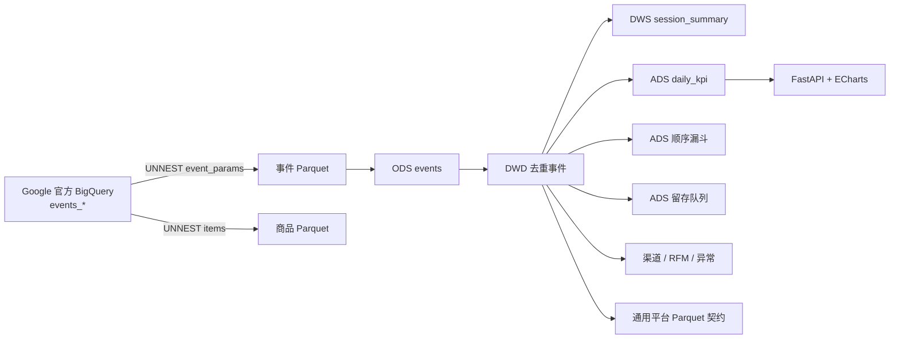

# 架构与数据血缘

```mermaid
flowchart LR
  A[Google 官方 BigQuery\nevents_*] -->|UNNEST event_params| B[事件 Parquet]
  A -->|UNNEST items| C[商品 Parquet]
  B --> D[ODS events]
  D --> E[DWD 去重事件]
  E --> F[DWS session_summary]
  E --> G[ADS daily_kpi]
  E --> H[ADS 顺序漏斗]
  E --> I[ADS 留存队列]
  E --> J[渠道 / RFM / 异常]
  G --> K[FastAPI + ECharts]
  E --> L[通用平台 Parquet 契约]
```

BigQuery 只负责读取官方嵌套源并展开必要字段；本地 DuckDB 负责可测试的分层加工。生产增量按 `_TABLE_SUFFIX` 日分区读取，DWD 用事件时间、事件名、匿名用户与订单号组合去重，受影响日期的 ADS 分区重算。

